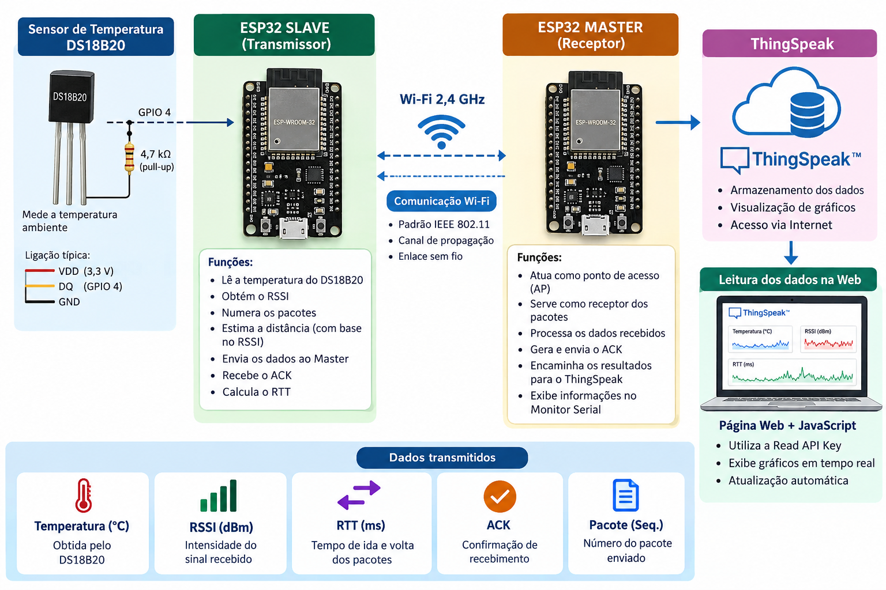

# Bancada Didática com ESP32 para Análise de um Enlace Wi-Fi

Projeto de uma bancada didática baseada em dois módulos **ESP32**, desenvolvida para aquisição, transmissão, armazenamento e visualização de parâmetros associados a um enlace de comunicação sem fio em **Wi-Fi 2,4 GHz**.

A proposta permite estudar, de forma experimental, métricas como **RSSI**, **RTT**, **ACK**, número de pacotes transmitidos e temperatura, relacionando os resultados a conceitos de propagação, atenuação, latência e confiabilidade em sistemas de telecomunicações e aplicações de Internet das Coisas (IoT).

---

## Arquitetura do projeto



A bancada utiliza dois módulos ESP32 com funções distintas:

- **ESP32 Slave:** transmissor dos dados;
- **ESP32 Master:** receptor, ponto de acesso e gateway;
- **DS18B20:** sensor responsável pela aquisição da temperatura;
- **ThingSpeak:** plataforma utilizada para armazenamento e visualização dos dados;
- **Página Web:** interface para apresentação dos gráficos e indicadores do enlace.

O fluxo geral de funcionamento é:

```text
DS18B20
   |
   v
ESP32 Slave / Transmissor
   |
   | Wi-Fi 2,4 GHz
   |
   v
ESP32 Master / Receptor
   |
   +---- Monitor Serial
   |
   v
ThingSpeak
   |
   v
Página Web + JavaScript
